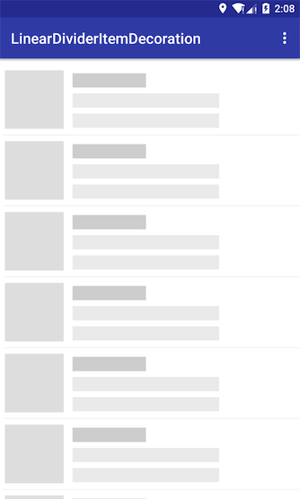
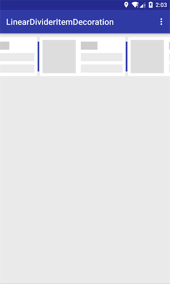
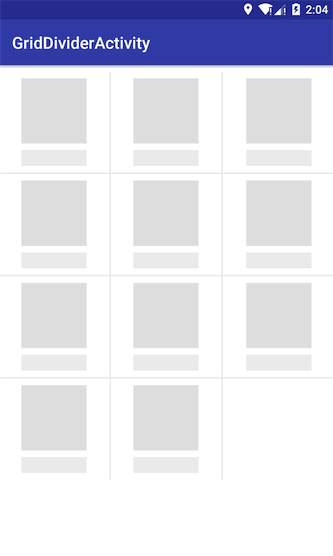
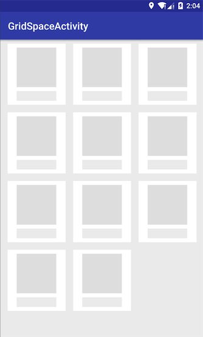
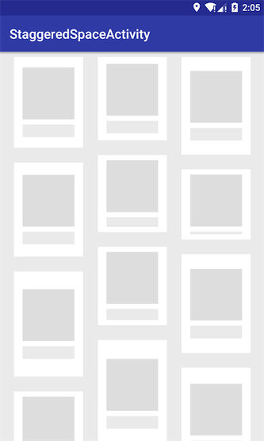

> 提供了RecyclerView常用的分隔封装类，包含`LinearLayoutManager`水平和垂直方向的分隔，以及针对`GridLayoutManager`和`StaggerGridLayoutManager`的网格线和`间隔均分`。对于分隔线可设置高度、颜色、`margin`、最后一行是否绘制等，对于间隔仅设置间隔大小即可。

#### 添加依赖
```
// root build.gradle
allprojects {
	repositories {
		...
		maven { url 'https://jitpack.io' }
	}
}

// app build.gradle
dependencies {
    compile 'com.github.dcq123:SimpleItemDecoration:v0.0.1'
}
```

#### 效果图：

<div>
    
    
    
    
    
    
<div>

#### 主要包含的类：

| 名称                          | 描述                                  |
| --------------------------- | ----------------------------------- |
| LinearDividerItemDecoration | LinearLayoutManager中水平和垂直布局分隔线的绘制   |
| LinearSpaceItemDecoration   | LinearLayoutManager中水平和垂直布局空白间隔的绘制  |
| GridDividerItemDecoration   | Grid和StaggeredLayoutManager中分隔线的绘制  |
| GridSpaceItemDecoration     | Grid和StaggeredLayoutManager中空白间隔的绘制 |

#### 用法：

垂直布局的分隔线如下定义

```java
mRecyclerView.addItemDecoration(
	new LinearDividerItemDecoration.Builder()  
		// 颜色     			
		.setDividerColor(getResources().getColor(R.color.colorBg))
		// 高度
        .setDividerHeight(2)
        // 间距
        .setLeftMargin(8)
        // 最后一个item的绘制是否显示
        .isShowLastDivider(false)
        // 布局方向
        .setOrientation(LinearLayoutManager.VERTICAL)
        .build()
);
```

垂直布局间隔：

```java
recyclerView.addItemDecoration(
        new LinearSpaceItemDecoration.Builder()
                .setOrientation(LinearLayoutManager.VERTICAL)
                .setSpaceSize(10)
                .build()
);
```

Grid网格线布局：

```java
recyclerView.addItemDecoration(
    new GridDividerItemDecoration.Builder()
    		// 列数
            .setColNum(colNum)
            // 分隔线高度
            .setDividerHeight(5)
            // 颜色
            .setDividerColor(getResources().getColor(R.color.colorBg))
            .build()
);
```

Grid网格间隔：

```java
recyclerView.addItemDecoration(
    new GridSpaceItemDecoration.Builder(recyclerView)
            .setColNum(colNum)
            .setSpaceSize(space)
            .build()
);
```

